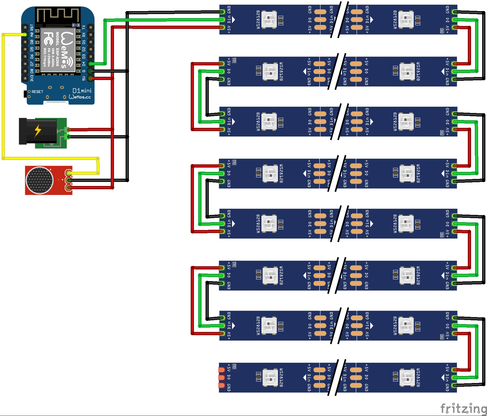

# FastLED + ESP8266 Web Server for Desk Light


This is a fork of [jasoncoon's esp8266 fastled webserver](https://github.com/jasoncoon/esp8266-fastled-webserver) that was adapted to control the colors of my  [WiFi Controlled Desk Lamp](https://www.thingiverse.com/thing:3676533)

[](https://youtu.be/Lymm2JvcB-8)


## Important!

**FastLED 3.2.7 & 3.2.8 DOES NOT WORK**

**esp8266 2.5.0 and above causes compilation errors**

**Arduino IDE 1.8.9 and above might cause Sketch-Data-Uploading Issues**


Hardware
--------

**Check out the project on [Thingiverse](https://www.thingiverse.com/thing:3676533)**

[](https://www.thingiverse.com/thing:3676533)

Features
--------
* Turn the Logo on and off
* **Sound Reactive Mode**
* Adjust the brightness
* Change the display pattern
* Adjust the color
* Activate pattern autoplay
* **React to sound**


### Upcoming Features

- **Node-RED** integration
  - Simple Amazon **Alexa** integration
  - Voice control


Web App
--------


The web app is stored in SPIFFS (on-board flash memory).


## Circuit




Installing
-----------
The app is installed via the Arduino IDE 1.8.8 which can be [downloaded here](https://www.arduino.cc/en/Main/OldSoftwareReleases#previous). 
The ESP8266 boards will need to be added to the Arduino IDE which is achieved as follows. Click File > Preferences and copy and paste the URL "http://arduino.esp8266.com/stable/package_esp8266com_index.json" into the Additional Boards Manager URLs field. Click OK. Click Tools > Boards: ... > Boards Manager. Find and click on ESP8266 (using the Search function may expedite this). Choose 2.4.2 and click on Install. After installation, click on Close and then select your ESP8266 board from the Tools > Board: ... menu.

The app depends on the following librarie. They must either be downloaded from GitHub and placed in the Arduino 'libraries' folder, or installed as [described here](https://www.arduino.cc/en/Guide/Libraries) by using the Arduino library manager.

- [FastLED 3.2.6](https://github.com/FastLED/FastLED)


Download the app code from GitHub using the **Releases** section on [GitHub](https://github.com/NimmLor/esp8266-fastled-desk-light/releases) and download the ZIP file. Decompress the ZIP file in your Arduino sketch folder. Rename the folder from *esp8266-fastled-desk-light-master* to *esp8266-fastled-desk-light*

### Configuration

First enter the pin where the *Data* line is connected to, in my case it's pin D4 (GPIO02).

`#define DATA_PIN D4`

The *LED_TYPE* can be set to any FastLED compatible strip. Most common is the WS2812B strip.

If colors appear to be swapped you should change the color order. For me, red and green was swapped so i had to change the color order from *RGB* to *GRB*.

You should also set the milli-amps of your power supply to prevent power overloading. I am using the regular USB connection so i defined 3000mA.

Another important step is to set the `LINE_COUNT` and `LEDS_PER_LINE` constants
LINE_COUNT defines how many columns the core has, the regular design has 8x slots.
LEDS_PER_LINE defines how many LED pixels one piece of the led strip has.

This project has feature to react to sound, this requires for the sound sensor to be connected to the microcontroller. It can be disabled by adding '\\\' in front of the following line.
`#define SOUND_REACTIVE`


To avoid an overload of the power supply you can set a maximum current limit.
`#define MILLI_AMPS 3000`

`#define RANDOM_AUTOPLAY_PATTERN` constant configures if the patterns in autoplay should be choosen at random, if you don't want this functionality just add '\\\' in the front.

Another **important** step is to create the **Secrets.h** file. Create a new tab (**ctrl**+**shift**+**n**) and name it *Secrets.h*, this file contains your WIFI credentials and it's structure must look like this:

```c++
// AP mode password
const char WiFiAPPSK[] = "WIFI_NAME_IF_IN_AP_MODE";

// Wi-Fi network to connect to (if not in AP mode)
char* ssid = "YOUR_WIFI_NAME";
char* password = "YOUR_WIFI_PASSWORD";
```

### Uploading

The web app needs to be uploaded to the ESP8266's SPIFFS.  You can do this within the Arduino IDE after installing the [Arduino ESP8266FS tool](http://esp8266.github.io/Arduino/versions/2.3.0/doc/filesystem.html#uploading-files-to-file-system). An alternative would be to install the [Visual Micro](https://www.visualmicro.com/) plugin for Visual Studio.

With ESP8266FS installed upload the web app using `ESP8266 Sketch Data Upload` command in the Arduino Tools menu.


## Technical

Patterns are requested by the app from the ESP8266, so as new patterns are added, they're automatically listed in the app.

The web app is stored in SPIFFS (on-board flash memory).

The web app is a single page app that uses [jQuery](https://jquery.com) and [Bootstrap](http://getbootstrap.com).  It has buttons for On/Off, a slider for brightness, a pattern selector, and a color picker (using [jQuery MiniColors](http://labs.abeautifulsite.net/jquery-minicolors)).  Event handlers for the controls are wired up, so you don't have to click a 'Send' button after making changes.  The brightness slider and the color picker use a delayed event handler, to prevent from flooding the ESP8266 web server with too many requests too quickly.

The only drawback to SPIFFS that I've found so far is uploading the files can be extremely slow, requiring several minutes, sometimes regardless of how large the files are.  It can be so slow that I've been just developing the web app and debugging locally on my desktop (with a hard-coded IP for the ESP8266), before uploading to SPIFFS and testing on the ESP8266.

### Compression

The web app files can be gzip compressed before uploading to SPIFFS by running the following command:

`gzip -r data/`

The ESP8266WebServer will automatically serve any .gz file.  The file index.htm.gz will get served as index.htm, with the content-encoding header set to gzip, so the browser knows to decompress it.  The ESP8266WebServer doesn't seem to like the Glyphicon fonts gzipped, though, so I decompress them with this command:

`gunzip -r data/fonts/`

### REST Web services

The firmware implements basic [RESTful web services](https://en.wikipedia.org/wiki/Representational_state_transfer) using the ESP8266WebServer library.  Current values are requested with HTTP GETs, and values are set with POSTs using query string parameters.  It can run in connected or standalone access point modes.
